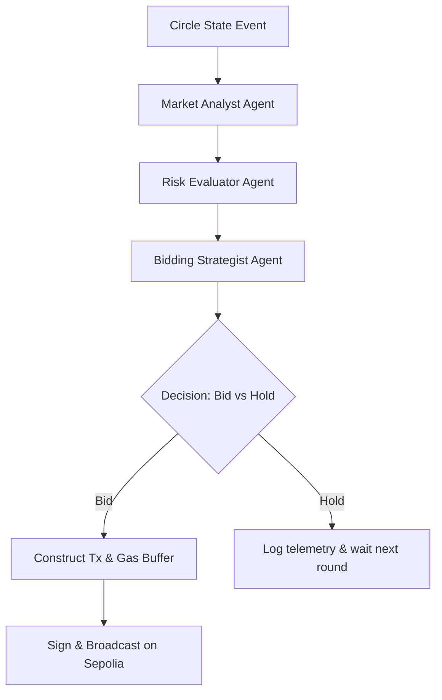

# Autonomous AI Bidding Agent Specification

## Overview
The ChitChain AI Bidding Agent acts as an intelligent delegate for circle participants. Powered by CrewAI and Groq LLMs (Llama-3-70b-versatile / Llama-3.3-70b-specdec), the agent evaluates circle health, member urgency, risk parameters, and token dividend economics.

## Agent Roles
1. **Market Analyst**: Evaluates remaining pot rounds, historical discount margins, and MST dividend yield.
2. **Risk Guardian**: Enforces collateral thresholds, wallet balance checks, and default probabilities.
3. **Execution Strategist**: Calculates optimal bid discount using modified Kelly Criterion to maximize net member value.
