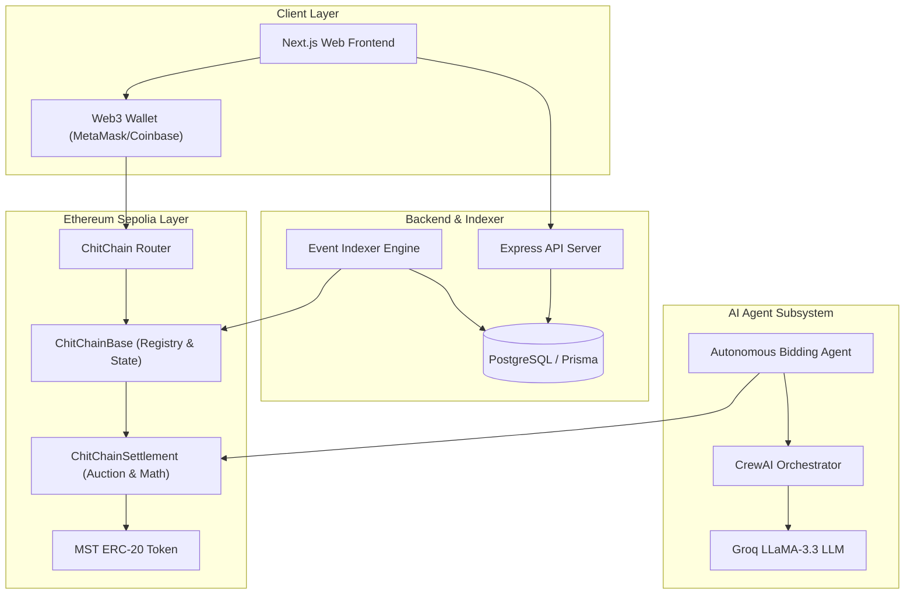

# ChitChain Complete System Architecture

```mermaid
graph TB
    subgraph Client ["Client Layer"]
        NextApp["Next.js Web Frontend"]
        Wallet["Web3 Wallet (MetaMask/Coinbase)"]
    end

    subgraph Blockchain ["Ethereum Sepolia Layer"]
        Router["ChitChain Router"]
        Base["ChitChainBase (Registry & State)"]
        Settlement["ChitChainSettlement (Auction & Math)"]
        MST["MST ERC-20 Token"]
    end

    subgraph OffChain ["Backend & Indexer"]
        Express["Express API Server"]
        Indexer["Event Indexer Engine"]
        DB[(PostgreSQL / Prisma)]
    end

    subgraph AIAgent ["AI Agent Subsystem"]
        Crew["CrewAI Orchestrator"]
        Groq["Groq LLaMA-3.3 LLM"]
        BiddingAgent["Autonomous Bidding Agent"]
    end

    NextApp --> Wallet
    Wallet --> Router
    Router --> Base
    Base --> Settlement
    Settlement --> MST

    Indexer --> Base
    Indexer --> DB
    Express --> DB
    NextApp --> Express

    BiddingAgent --> Crew
    Crew --> Groq
    BiddingAgent --> Settlement
```
